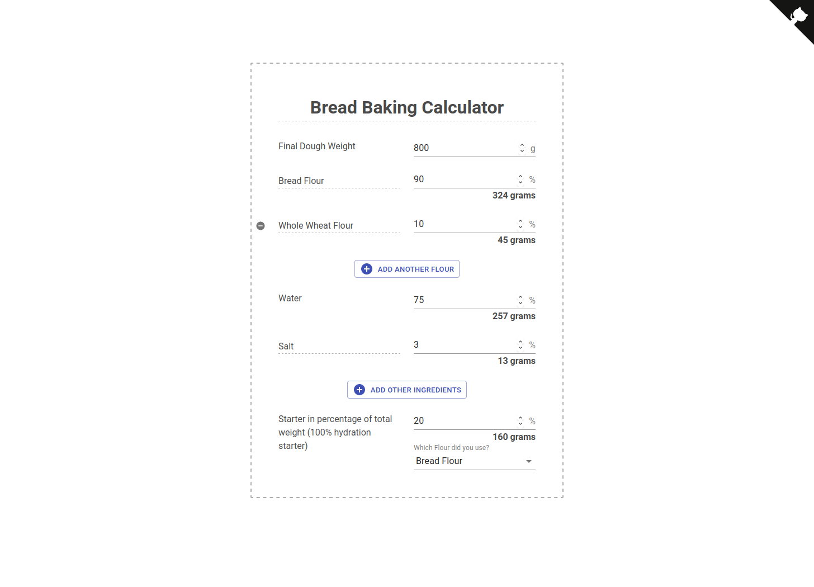

# bread-baking-calculator

Access the baker's percentage calculator at: https://breadcalc.joynetiks.com/

Everything underlined in the UI can be freely edited.  
The state of the calculator is saved in the URL, so you can just bookmark the full URL of your recipes and the calculator will restore the state on load.




# Development

```
$> yarn install && yarn build && yarn start
```

Using parcel for building.
